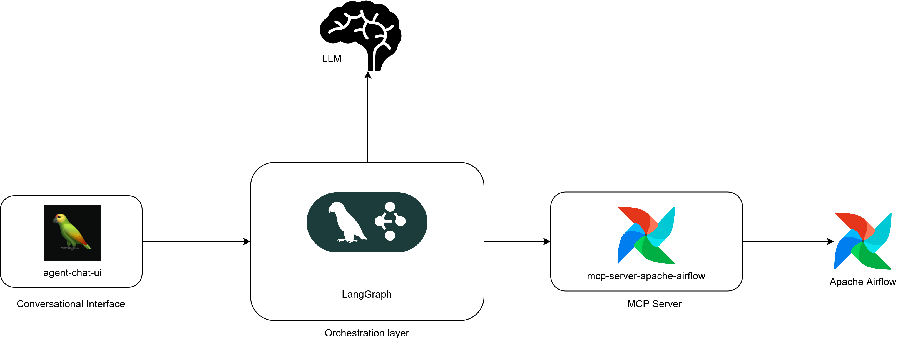

# Vayu Pipeline Copilot 🚀
A conversational AI assistant for interacting with workflow orchestration tools. Currently supporting Apache Airflow, Vayu helps you manage and interact with your data pipelines through natural language conversations.

## Architecture


* agent-chat-ui - https://github.com/langchain-ai/agent-chat-ui
* mcp-server-apache-airflow - https://github.com/yangkyeongmo/mcp-server-apache-airflow
* LangGraph - https://www.langchain.com/langgraph
* Apache Airflow - https://airflow.apache.org/

## Project Structure


├── copilot_agents/ # Main agent implementation directory
│ ├── src/ # Source code for the agent
│ │ └── agent/ # Core agent implementation
│ │ ├── graph.py # Defines the LangGraph workflow and agent interactions
│ │ └── dag_manager.py # Implements the DAG management agent with LLM integration
│ ├── tests/ # Test files for the agent
│ ├── static/ # Static files for the agent
│ ├── Dockerfile # Docker configuration for the agent
│ ├── requirements.txt # Python dependencies
│ └── pyproject.toml # Project configuration and metadata
├── docs/ # Documentation files
├── docker-compose.yml # Docker Compose configuration for all services
└── README.md # Project documentation


## Getting Started

### Prerequisites

Before you begin, ensure you have the following installed:
- Docker and Docker Desktop
- Docker Compose
- Git client

### Local Development Setup

1. Clone the repository:
   ```bash
   git clone https://github.com/your-username/data-pipeline-agent.git
   cd data-pipeline-agent
   ```

2. Configure the LLM:
   - Create a `.env` file in the root directory:
     ```bash
     cp .env.example .env
     ```
   - Add your Google AI API key:
     ```
     GOOGLE_API_KEY=your_api_key_here
     ```
   - The project uses Google's Gemini 2.0 Flash by default. You can change the LLM by modifying the `DAGMANAGER_LLM` environment variable:
     ```
     DAGMANAGER_LLM=google_genai:gemini-2.0-flash
     ```
   - To use a different LLM:
     1. Add the required provider package to `requirements.txt`. For example:
        - For OpenAI: `langchain-openai`
        - For Anthropic: `langchain-anthropic`
        - For Azure OpenAI: `langchain-azure-openai`
     2. Update the `DAGMANAGER_LLM` environment variable:
        ```
        # For OpenAI
        DAGMANAGER_LLM=openai:gpt-4-turbo-preview
        
        # For Anthropic
        DAGMANAGER_LLM=anthropic:claude-3-opus-20240229
        ```
     Note: Ensure the selected LLM supports tool calling functionality. For more information on configuring different LLM providers, refer to the [LangChain LLM Integration Guide](https://python.langchain.com/docs/modules/model_io/models/).

3. Start the services using Docker Compose:
   ```bash
   docker-compose up -d
   ```

4. Verify that all services are running:
   ```bash
   docker-compose logs -f
   ```

5. Make sure services are accessible:
   - LangGraph Server: http://localhost:2024
   - Airflow Web UI: http://localhost:8080
   - Airflow API: http://localhost:8080/api/v1

### Connecting to the Agent

Instead of running the client application locally, you can use the deployed Agent Chat UI:

1. Visit https://agentchat.vercel.app/
2. In the setup form, use the following configuration:
   - API URL: http://localhost:2024
   - Assistant ID: agent

3. Click "Continue" to start interacting with the agent through the chat interface.

The agent will now be connected to your local LangGraph server and ready to help you manage your data pipelines.
